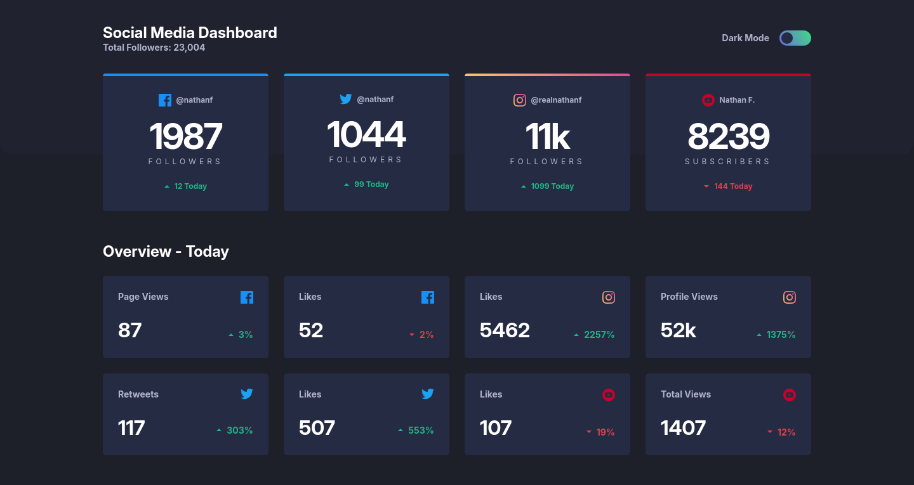
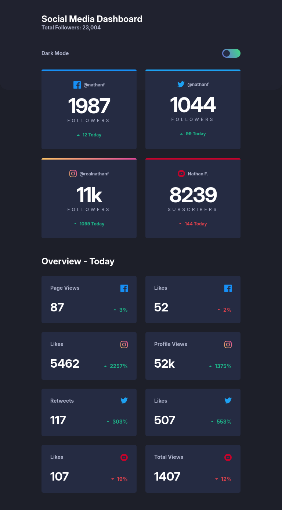
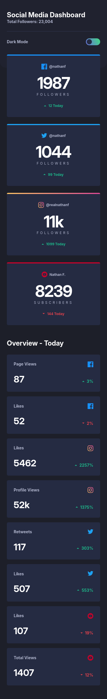
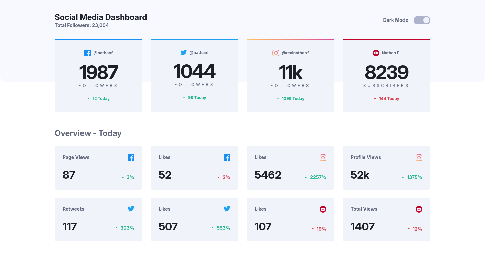
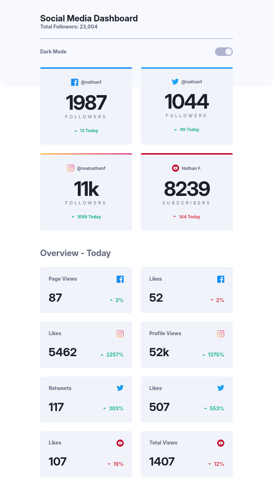
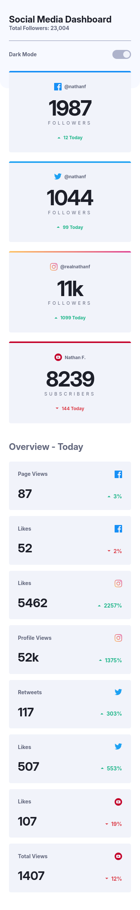

# Frontend Mentor - Social media dashboard with theme switcher solution

This is a solution to the [Social media dashboard with theme switcher challenge on Frontend Mentor](https://www.frontendmentor.io/challenges/social-media-dashboard-with-theme-switcher-6oY8ozp_H). Frontend Mentor challenges help you improve your coding skills by building realistic projects.

## Table of contents

- [Overview](#overview)
  - [The challenge](#the-challenge)
  - [Screenshot](#screenshot)
  - [Links](#links)
- [My process](#my-process)
  - [Built with](#built-with)
  - [What I learned](#what-i-learned)
  - [Continued development](#continued-development)
  - [AI Collaboration](#ai-collaboration)
- [Author](#author)

## Overview

### The challenge

Users should be able to:

- View the optimal layout for the site depending on their device's screen size
- See hover states for all interactive elements on the page
- Toggle color theme to their preference

### Screenshot

#### Dark mode

|  |  |  |
| ------------------------------ | ----------------------------- | ----------------------------- |
| Desktop                        | Tablet                        | Mobile                        |

#### Light mode

|  |  |  |
| ------------------------------------ | ----------------------------------- | ----------------------------------- |
| Desktop                              | Tablet                              | Mobile                              |

### Links

- Solution URL: https://github.com/Yahyaball/social-media-dashboard-with-theme-switcher
- Live Site URL: https://social-media-dashboard-with-theme-switcher-8w51vpesc.vercel.app

## My process

### Built with

- HTML5
- SCSS
- TypeScript
- [Vue.js](https://vuejs.org/) - JS Framework
- [VueUse](https://vueuse.org/) - Vue composition utilities
- [Motion](https://motion.dev/) - JS animation library
- [Pinia](https://pinia.vuejs.org/) - Vue.js store

### What I learned

**Sass variables can't switch themes.** `$navy-950` compiles to `#252b42` and stops existing, so a runtime theme change needs CSS custom properties. This is the main thing I'd do differently — my light theme works through duplicated `data-theme` blocks instead of shared tokens.

**Layout bugs hide in the details.** A breakpoint only overrides rules on the same element, so mine stacked instead of replacing and content got _narrower_ as the window got wider. And because `box-sizing: border-box` includes padding, my max-width was capping the total box, not the content.

**Vue reactivity depends on context.** Template refs auto-unwrap, but only top-level ones — so `const isDesktop = breakpoints.desktop` silently never updated.

**Type checking catches real bugs.** `@click="toggleDark"` passed a`PointerEvent` into a function expecting a boolean and pinned the theme to a truthy object. `vue-tsc` flagged it as a type error; it was a live runtime failure.

**Accessibility is arithmetic.** I calculated contrast ratios from my actual token values, which showed my green/red change colours fail badly on card backgrounds (2.36:1) despite passing on the page background. Eyeballing would never have caught it.

### Continued development

- Convert the palette to CSS custom properties so both themes share one rule set
- Add a shared `:focus-visible` mixin, checked against every background
- Learn unit testing, so formatting logic has a safety net

### AI Collaboration

I used Big Pickle via opencode as a reviewer rather than a code generator.

The most useful moments were asking it to _verify_ rather than answer — compiling my SCSS to show where a media query really landed, and computing contrast ratios from my tokens. Both found bugs I'd have missed reading the source. It was also wrong twice, and pushing back on it was correct.

What didn't work: I asked it to implement a refactor and it edited four files into a broken build. Reverting was easy, but the lesson stands — one step at a time, with a green build between steps.

## Author

- Frontend Mentor - [@Yahyaball](https://www.frontendmentor.io/profile/Yahyaball)
